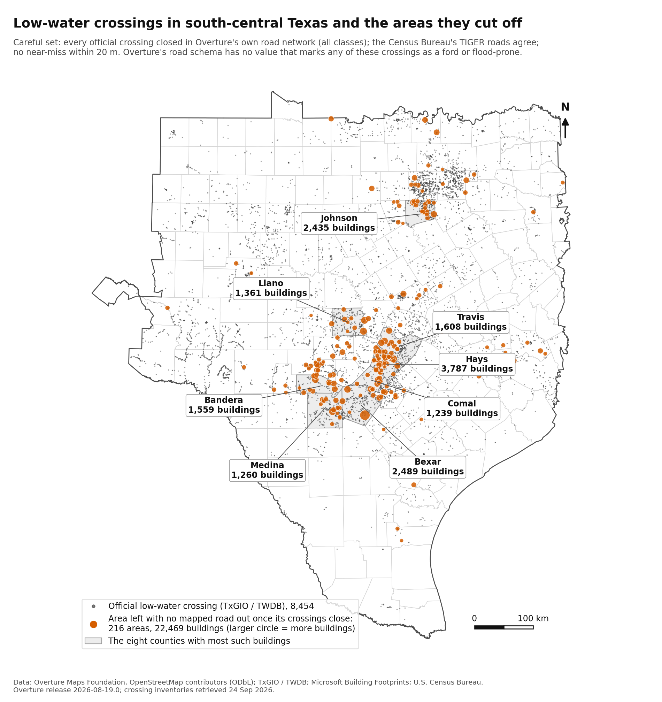

# Bias Bounty Mapping Equity Challenge: the coverage gap score, and the flood crossings it cannot see

Code and results behind my writeup for Zindi's Bias Bounty Mapping Equity Challenge.
Author: Peter Tinashe Mundowa (Zindi: PeterTheAnalyst).

## One writeup, two parts

The challenge judges both special prizes from the methodology writeup, so my entry is one post in two parts (post:
[thread 35033](https://zindi.world/competitions/bias-bounty-mapping-equity-challenge/discussions/35033)). [WRITEUP.md](WRITEUP.md) is that post with its tables rendered, followed by the appendices
Part 1 points to.

**Part 1, methodology (Best Documentation): how my scored column is built** (code: [documentation/](documentation/)).
One script, `pipeline.py`, builds the coverage gap score for all 9,379 scored tracts from the organisers' data,
reproduces every count the data README publishes and writes the file scored as submission 1S1Ei46w (public error
0.00000301) byte for byte; with PROJ built for fused multiply-add the same pipeline scores exactly 0. Part 1 measures
how far each open choice of the specification moves the 9,379 values and the scorecard's ratios.

**Part 2, Best Bias Discovery: Texas low-water crossings, where roads go under water, appear on the open map as
ordinary roads** (code: [discovery/](discovery/); outcomes: [results/](results/)). Overture has the road at 93.1%
of the 8,454 official low-water crossings in the challenge's Texas region and marks none as a crossing that floods,
because its road schema has no value that could say so; the scorecard, which compares highway lengths, cannot see it.
Closing the crossings in Overture's own network leaves 22,469 buildings (about 26,300 residents) in 216 areas with no
mapped road out, and TIGER agrees; NOAA flood reports tie 20 deaths since 1996 to 16 named crossings. Two readings of a
random sample on aerial imagery put 5,067 to 14,426 of those buildings behind no dry way out at all
([results/audit/](results/audit/)).

## Data change on 25 September 2026

The organisers' README for the challenge bucket now opens: "2026-09-25: TIGER/Line roads, Microsoft building
footprints, HIFLD facilities and CBP establishments were removed from every region at the challenge organizers'
request." Both parts read those layers, so neither can be rerun from the bucket alone any more: each now takes a
folder of copies made before that date (`--data-dir DIR`) and ships a manifest with the size and sha256 of every
challenge file it read, so a copy can be checked ([discovery/INPUTS_MANIFEST.csv](discovery/INPUTS_MANIFEST.csv),
[documentation/INPUTS_MANIFEST.csv](documentation/INPUTS_MANIFEST.csv)). The original public sources of the
footprints and the roads are Microsoft Global ML Building Footprints
(https://github.com/microsoft/GlobalMLBuildingFootprints) and the U.S. Census Bureau's TIGER/Line 2025 roads
(https://www2.census.gov/geo/tiger/TIGER2025/ROADS/); the challenge's copies were clipped to each region, so a
download from those sources is not the same file and has not been tested as a substitute. No removed layer, and no
other challenge data file, is in this repository. On 26 September both parts were rerun from local copies, with
nothing read from the bucket: the scored file and every shipped table came out byte for byte as before
([TESTING.md](TESTING.md), sections 1, 2 and 2b).

## Licences

- **Code**: MIT ([LICENSE](LICENSE)).
- **Result tables** in [results/](results/): ODbL 1.0, as databases derived from Overture and OpenStreetMap; the
  crossing inventory fields are also covered by the Texas Water Development Board's permission to copy and distribute,
  and the NOAA values are public domain. They hold no value from the challenge's strata table (CC BY-SA 4.0):
  `discovery/join_strata.py` joins those columns by GEOID on your own machine.
- **Inputs shipped** in [discovery/inputs/](discovery/inputs/): the OpenStreetMap ford and flood tags (ODbL 1.0) and
  the two Texas crossing inventories (TWDB permission). The NOAA file list in `results/ncei/` is a record of public
  domain files.
- **Challenge data** (CC BY-SA 4.0 as a bundle, each layer with its own terms) and USGS imagery are downloaded or drawn
  locally and never redistributed.

Full terms and attributions: [DATA_LICENCES.md](DATA_LICENCES.md).

## Layout

    README.md                  this page
    WRITEUP.md                 the writeup, one post in two parts, with its tables rendered and Part 1's appendices
    LICENSE                    MIT, for the code
    DATA_LICENCES.md           the terms of every data source, shipped or downloaded
    TESTING.md                 quick checks, full-run commands, expected outputs, sha256 values, what is checked
    smoke_test.sh              light checks: seconds, no download
    scan_public_repo.sh        safety scan of every file git would commit
    documentation/             Part 1, the methodology (Best Documentation)
        README.md              how to run it (WRITEUP.md here points to the one at the root)
        pipeline.py            the scored column, all four regions, one file
        sensitivity.py         the open-choice tables, rebuilt from the per-tract counts
        tools/                 build_proj_fma.sh (PROJ with fused multiply-add), fingerprint.py,
                               extra_variants.py (the variants that need geometry again), scorecard_ratios.py
                               (the scorecard's ratios under every variant), acceptance_window.py
        INPUTS_MANIFEST.csv    size and sha256 of the 44 challenge files the pipeline reads (and the strata tables)
        requirements.txt
    discovery/                 Part 2, Best Bias Discovery
        README.md              the steps, their inputs and outputs, and how to add one (WRITEUP.md here points to the
                               one at the root)
        run_all.sh             every step in order
        common.py, v4_common.py  shared paths, input checks and loaders
        INPUTS_MANIFEST.csv    size and sha256 of the nine challenge files the discovery reads, and of the Overture
                               extra road classes it downloads
        *.py                   one script per step; join_strata.py adds strata-table columns to the results locally
        inputs/                the crossing inventories (24 Sep 2026) and OSM tags (23 Sep 2026) the run read
        requirements.txt
    results/                   the discovery's outcomes: crossings.csv, areas.csv, careful_tracts.csv,
                               crossing_tracts.csv, variants.csv, core_numbers.json, figures/, ncei/ (the NOAA
                               flood reports and the file list they come from) and audit/ (the imagery audit's
                               sample, both readings and their comparison), with what each column means

Downloads, caches and outputs (`cache/`, `raw/`, `work/`, `out/`, `figs/`, `figs_audit/`) are created by the scripts
and never committed; `.gitignore` keeps them out.

## Quick start

Python 3.11 (tested with 3.11.15 on Linux); 2 cores and 8 GB of memory are enough for both.

    python3 -m venv .venv && . .venv/bin/activate
    pip install -r documentation/requirements.txt -r discovery/requirements.txt

**Part 1, methodology.** With the 44 challenge files (about 5 GB) in a folder DIR (see above), under 4 minutes:

    cd documentation
    python pipeline.py --check --data-dir DIR

It checks every input against `documentation/INPUTS_MANIFEST.csv`, writes `submission.csv` (9,379 rows, GEOID and
coverage_gap_score) and prints its sha256,
`40aea8185bdf0aa7b2653d237581e6cb8adfa3df59de4a15b1ec06fcc5f7c289`. The sensitivity tables and the fused
multiply-add build are in [documentation/README.md](documentation/README.md).

**Part 2, discovery.** It reads the per-tract counts of the documentation pipeline's `--extra` run (about 18 minutes).
From local copies it then took 21 minutes on 26 Sep 2026 (Census block queries included), plus about 4 minutes to
download 577 MB of Overture roads; the NOAA step added since takes about 100 s to download 337 MB of Storm Events files
and under a minute to run. It writes about 1.1 GB to `discovery/work/`. DIR is the folder of challenge layers copied
before 25 September 2026 (see above; [discovery/README.md](discovery/README.md) lists the names it accepts):

    cd documentation && python pipeline.py --check --extra --data-dir DIR
    cd ../discovery && bash run_all.sh --data-dir DIR

It rebuilds every table and figure in `results/`; [TESTING.md](TESTING.md) lists the lines and sha256 values to
expect. It needs network access to the Overture bucket on S3, the Census Bureau's TIGERweb service, NOAA's NCEI file
server and the DuckDB extension repository (and to the challenge bucket when run without `--data-dir`).

## Data sources

| Source | Where | Terms | Used by |
|---|---|---|---|
| Challenge data: tracts, strata table, Overture roads, buildings and places (release 2026-08-19.0), TIGER/Line roads, Microsoft footprints, USGS facilities, County Business Patterns (the last four removed from the bucket on 25 Sep 2026, see above) | https://data.source.coop/humane-intelligence/bias-bounty-mapping-equity-challenge/ | CC BY-SA 4.0 (challenge rules), and each layer's own terms: Overture buildings and transportation ODbL 1.0, places mostly CDLA Permissive 2.0, Microsoft footprints CDLA Permissive 2.0, Census and USGS layers public domain; downloaded, never redistributed | both |
| TxGIO Low Water Crossing inventory | https://feature.geographic.texas.gov/arcgis/rest/services/Basemap/Low_Water_Crossing/MapServer/0 | TWDB site policy: permission to copy and distribute | discovery |
| TWDB State Flood Plan, layer "Low Water Crossing" | https://gis2.twdb.texas.gov/server/rest/services/OOP_FP_SFPV/Existing_Flood_Risk_Map/FeatureServer/5 | TWDB site policy: permission to copy and distribute | discovery |
| OpenStreetMap, Texas extract of 23 Sep 2026 | https://download.openstreetmap.fr/extracts/north-america/us-south/texas.osm.pbf | ODbL 1.0 | discovery |
| Overture Maps 2026-08-19.0, transportation theme (service, track, living_street, unknown) | s3://overturemaps-us-west-2/release/2026-08-19.0/theme=transportation/ | ODbL 1.0 | discovery |
| 2020 Census blocks | https://tigerweb.geo.census.gov/arcgis/rest/services/TIGERweb/tigerWMS_Census2020/MapServer/10 | public domain | discovery |
| NOAA NCEI Storm Events Database, bulk files 1996 to 2025 (details, fatalities, locations; the 90 files read are listed with sha256 in `results/ncei/ncei_manifest.json`) | https://www.ncei.noaa.gov/pub/data/swdi/stormevents/csvfiles/ | public domain | discovery |
| USGS orthoimagery (checks and the imagery audit; drawn locally, never committed) | https://basemap.nationalmap.gov/arcgis/rest/services/USGSImageryOnly/MapServer | public domain | discovery |
| PROJ 9.5.1 source | https://github.com/OSGeo/PROJ/releases/download/9.5.1/proj-9.5.1.tar.gz | MIT | documentation |

The inventories and the OSM tags change over time, so the files the entry's run read are shipped in
[discovery/inputs/](discovery/inputs/). The NOAA files are too large to ship; the manifest pins them by sha256.

## Reproducibility

- **Pinned versions.** geopandas 1.1.4, shapely 2.1.2 (GEOS 3.13.1), pyproj 3.7.2 (PROJ 9.5.1), pyarrow 25.0.1,
  pandas 3.0.2 and numpy 2.4.4; the discovery adds duckdb 1.5.5, scipy 1.17.1, matplotlib 3.10.9, pillow 12.2.0
  and osmium 4.3.1.
- **No randomness in the scored column**: no model, no seed, no manual step, no score file read. The discovery's
  random steps (buildings sampled in the TIGER check, imagery panels, the bootstrap intervals, the imagery audit's
  sample) use fixed seeds. Its one step that is not code, the imagery audit's two readings (the sample read twice,
  independently, from the same renders, following written rules), is shipped as files in
  [results/audit/](results/audit/) and checked against the sample each run draws.
- **Expected outputs.** `submission.csv`: sha256 `40aea8185bdf0aa7b2653d237581e6cb8adfa3df59de4a15b1ec06fcc5f7c289`
  with the pyproj wheels on Intel or AMD (two machines, same bytes), and
  `30110feb61ee848973a9b7543741c7d586fdf850e26da3854816cd26e2486908` with PROJ built for fused multiply-add.
  The discovery's tables and summary files: sha256 values in [TESTING.md](TESTING.md).
- **Checked inputs.** Every challenge layer, the Overture extra road classes and the 90 NOAA files are checked against
  a manifest by sha256; [TESTING.md](TESTING.md) lists what is checked and what is read live.
- **Stops rather than writes a wrong file.** The pipeline checks every input against its manifest and asserts the
  README's published counts; every discovery script names any missing input and the command that makes it.
- **What cannot be pinned here.** The challenge layers and Overture release 2026-08-19.0 are downloaded or read
  from local copies, not shipped; four of the challenge layers have already left the bucket (see above), and the
  manifests say whether a copy is the one each part read. NCEI replaces a year's Storm Events file when it corrects
  it; the NOAA step then stops, and `--refresh` takes the current files. If Overture retires that release,
  [results/](results/) still carries the discovery's outcomes.

## Citation

Mundowa, P. T. (2026). Methodology writeup with a Best Bias Discovery section: exact coverage-gap reconstruction, and
Texas low-water crossings the open map carries as ordinary roads. Bias Bounty Mapping Equity Challenge, Zindi.
https://zindi.world/competitions/bias-bounty-mapping-equity-challenge/discussions/35033

## Contact

Zindi user PeterTheAnalyst: a message on Zindi, or a reply on the writeup's thread.
